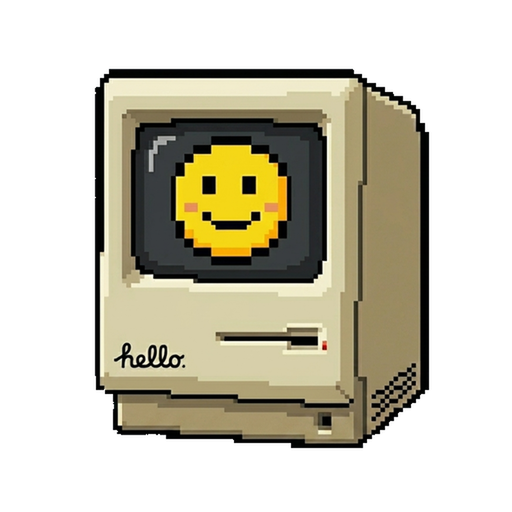

<div align="center">
  <p>
    <a href="./README.md"><strong>English</strong></a>
    ·
    <a href="./README.zh-CN.md"><strong>简体中文</strong></a>
  </p>

  

  <h1>Zest Wallpaper</h1>

  <p><strong>macOS-only wallpaper player for importing and playing Wallpaper Engine projects.</strong></p>

  <p>
    
    
    
    
  </p>

  <p>
    <a href="https://github.com/lgcenen/zest-wallpaper/stargazers"></a>
    <a href="https://github.com/lgcenen/zest-wallpaper/forks"></a>
    <a href="https://github.com/lgcenen/zest-wallpaper/issues"></a>
  </p>
</div>

## Status

This project is under active development.

## Community

- QQ group: `867740762`

## Scope

| Capability | Status |
| --- | --- |
| Scene wallpapers | Partially supported |
| Video wallpapers | Supported |
| Web wallpapers | Supported |
| Audio input | Supported |
| Multi-display | Untested |
| Workshop wallpaper download | Not supported |

## Platform and Stack

- macOS `15.0+` only
- Tauri 2
- React + Vite
- Rust

## Development

Prerequisites:

- Node.js
- Rust toolchain
- Xcode Command Line Tools

Install dependencies:

```bash
npm install
```

Run the frontend:

```bash
npm run dev
```

Run the full Tauri app in development:

```bash
npm run tauri:dev -- --no-watch
```

Build the frontend:

```bash
npm run build
```

Build the app bundle:

```bash
npm run tauri:build
```

Run tests:

```bash
npm test
cargo test -j 1 --manifest-path src-tauri/Cargo.toml
cargo check -j 1 --manifest-path src-tauri/Cargo.toml
```

## Assets and Legal Boundaries

This repository does not ship third-party proprietary wallpaper assets.

Important constraints:

- imported wallpaper content is expected to come from the user
- external `assets` directories may be mounted locally to improve Scene compatibility
- the app must remain runnable even without external assets
- this project does not copy source code, resources, or symbol naming from third-party reference apps

If you use local external assets, keep them outside this repository.

## Special Thanks

Thanks to these projects for public tooling and ecosystem reference value:

- [`repkg`](https://github.com/notscuffed/repkg)
- [`linux-wallpaperengine`](https://github.com/Almamu/linux-wallpaperengine)

## License

Apache License 2.0. See [LICENSE](./LICENSE).

## Disclaimer

`Wallpaper Engine` is a third-party product. This project is an independent macOS player and is not affiliated with, endorsed by, or distributed with proprietary Wallpaper Engine assets.
